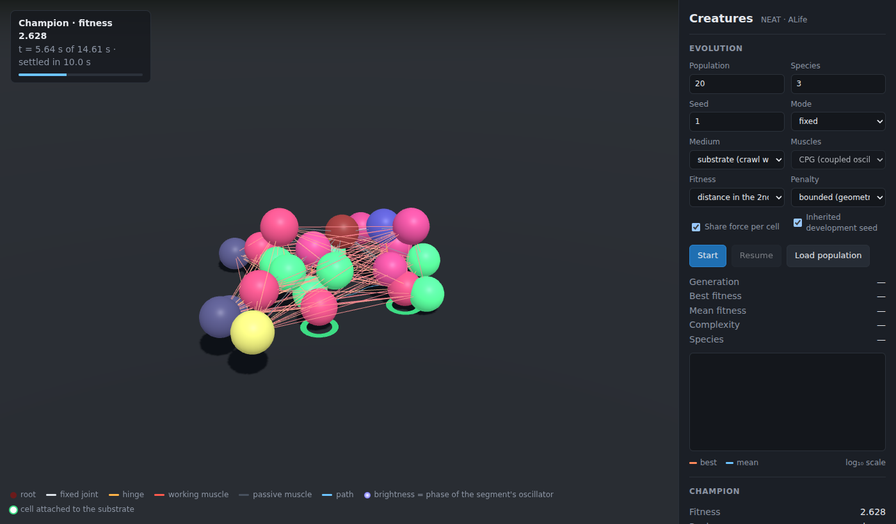

# Open-Ended Evolutionary Development of Cell-Based Locomotory Morphologies

Artificial creatures made of cells that grow, move and evolve, in the browser.



Creatures made of cells grow from a single cell. A neural network evolved with NEAT acts as a gene
regulatory network: it does not encode the body, only the rules of development (where each new cell
goes, how it is attached, which cells get muscles and how they move). The creatures are then
simulated and selected by the distance they travel.

## Origin

This is a TypeScript port and continuation of a Unity project developed in 2016–2017 in the Complex
Systems Research Group at Manchester Metropolitan University (UK), by Carlos Herrera Pérez,
Matthew Crossley and René Doursat, and presented as a video entry to the
4th Virtual Creatures Competition at GECCO 2017 (Berlin):

> *Open-Ended Evolutionary Development of Cell-Based Locomotory Morphologies* —
> video: <https://vimeo.com/220451078>

The original experiments used UnityNEAT (a Unity port of SharpNEAT) and were inspired by
morphogenetic engineering [1, 2]. The project was recovered in 2026 from its last surviving Unity
package; the original C# scripts are in [`legacy/`](legacy/).

## Status

The faithful port reproduces the original behaviour, including its bugs (which can be switched on
or off). Building on it, the creatures now **crawl reliably on a 3D substrate**: a contraction wave
generated by coupled phase oscillators travels along an articulated body, synchronised with cells
gripping and releasing the floor. The best creatures move at ~0.5 units per second with 20–23 cells.
Everything is deterministic and reproducible, and the physics has been checked for convergence
(evolution finds and exploits numerical errors very efficiently).

What was tried, what worked and what did not is documented in [EXPERIMENTS.md](EXPERIMENTS.md).
The main findings:

- Crawling with phase-controlled adhesion is ~70× more effective than swimming at low Reynolds
  number for these bodies.
- Making the random choices of development heritable (an *inherited development seed*) triples the
  mean speed of the population: the randomness in development is not only noise, it is the source of
  body diversity.
- The original fitness function has several traps (a multiplicative muscle penalty, a 3-unit
  cut-off, rewards for tipping over) that explain why locomotion was hard to evolve in Unity.
- Run-to-run variance is large (±50 %): conclusions need several seeds.

Runs are still short (bodies of ~20 cells, trials of ~15 s). Reaching 100+ cells and one-minute
lifetimes would need a different muscle architecture and more computing power.

## Quick start

Requires Node.js 20 or later.

```bash
npm install
npm run dev          # viewer at http://localhost:5173
npm test
```

In the viewer, use **Load champions** to open the creatures in [`gallery/`](gallery/) (several files
can be selected at once), or start an evolution in the browser with **Start**.

Evolution from the command line, using all CPU cores:

```bash
# the configuration that works best (3D substrate, inherited development seed)
npm run evolve -- --medium substrate --penalty geometric-mean --sharing --seeds inherited \
  --pop 50 --species 5 --gens 100 --out runs/my-run

npm run compare -- runs/my-run runs/other-run   # speed curves of several runs
npm run assess -- runs/my-run --samples 3       # fair re-evaluation of the saved population
```

Each run writes `config.json`, `stats.csv`, the champion of every generation in `champions/` (open
them in the viewer) and a population checkpoint every 10 generations (continue with `--resume`).

## How it works

**Development.** Growth starts from a root cell. Each cell asks the network, given its features
(level from the root, level in its region, orientation, region), where to put a new cell (6
directions) and whether to attach it with a *fixed joint* or a *hinge*. Hinges start new *regions*.
The number of cells grows slowly with the generation (a curriculum from the original design). The
network outputs are probabilities, so development is stochastic.

**Muscles.** Muscles connect cells of different regions; the network decides which ones work and
how. Three models are available:

- `accumulative` (the original): each step adds `0.15·sin(2π·f·t + a)` to the length.
- `oscillator`: `L(t) = L₀·(1 + A·sin(2π·f·t + φ))`, one frequency for the whole creature.
- `cpg`: coupled phase oscillators (in the style of Ijspeert), one per rigid segment, coupled across
  the hinges: `dθᵢ/dt = 2πνᵢ + Σ wᵢⱼ·sin(θⱼ − θᵢ − φᵢⱼ)`. The network sets the frequencies, coupling
  weights and phase lags during development; coordination emerges from the coupling.

**Media.**

- `ground` (as in Unity): masses, gravity and a floor with friction.
- `viscous`: a low-Reynolds fluid without inertia, simulated as Stokes dynamics of articulated rigid
  bodies with anisotropic drag (resistive force theory). Reciprocal motion does not move a body
  (Purcell's scallop theorem).
- `substrate`: the same solver plus weight and a floor. Cells touching the floor can grip it or not,
  depending on the phase of their oscillator; the network decides which cells are adhesive and
  their phase offset. This is how real cells and worms crawl.

**Fitness.** The distance travelled by the centre of mass, divided by the number of regions and by
a muscle penalty, with a 3-unit cut-off below which the fitness is divided by 10 000 (all from the
original design). On the substrate a settling phase comes first, and only the second half of the
trial counts, so that falling or tipping over is not rewarded.

**NEAT** (`src/neat/`) is a faithful port of SharpNEAT 2: genome, mutations, crossover, k-means
speciation and complexity regulation, with the parameters of the original project.

## Command-line options

`npm run evolve -- [options]`

| Option | Values (default first) | Meaning |
|---|---|---|
| `--medium` | `ground`, `viscous`, `substrate` | physical medium |
| `--mode` | `fixed`, `original` | fix or reproduce the bugs of the C# code |
| `--muscles` | per medium: `accumulative`, `oscillator`, `cpg` | muscle model (`cpg` on the substrate) |
| `--fitness` | per medium: `full`, `second-half` | which part of the trial counts |
| `--penalty` | `product`, `geometric-mean` | muscle penalty (the original product explodes with many muscles) |
| `--seeds` | `per-evaluation`, `inherited` | new growth at each evaluation, or a heritable development seed |
| `--development` | `stochastic`, `deterministic` | draw choices from the network outputs, or take the most likely |
| `--regions` | `yes`, `no` | divide the fitness by the number of regions |
| `--scope` | `all`, `hinge` | muscles between all pairs, or only across a hinge |
| `--sharing` | flag | each cell shares its contractile force among its muscles (much faster) |
| `--positional` | flag | give the network the position of each cell |
| `--settle` | per medium: `on`, `off` | settling phase before the trial |
| `--friction` | `inf` or a number | floor friction (`ground`) |
| `--pop`, `--species`, `--gens`, `--seed` | numbers | NEAT settings (defaults 8, 2, 100, 1) |
| `--threads` | number | worker threads (default: all cores) |
| `--out`, `--resume` | paths | output folder; population checkpoint to continue from |

## Project structure

| Path | Contents |
|---|---|
| `src/neat/` | NEAT (port of SharpNEAT) |
| `src/sim/creature.ts` | development, muscles, CPG, adhesion and fitness (port of `controler13.cs`) |
| `src/sim/physics.ts` | `ground` medium: XPBD with shape matching |
| `src/sim/stokes.ts` | `viscous` and `substrate` media: inertia-free rigid-body Stokes solver |
| `src/cli/` | command-line evolution, comparison and assessment, parallel evaluation |
| `src/viewer/` | three.js viewer and in-browser evolution (web worker) |
| `test/` | tests, including physics invariants and convergence checks |
| `gallery/` | champions from the experiments in EXPERIMENTS.md |
| `legacy/` | the original Unity C# scripts |

## Differences from the Unity version

- Cells are point masses with a collision radius, not rolling rigid bodies.
- Hinges are ball joints with the pivot at the centre of the parent cell, plus a weak spring towards
  the initial angle; there is no hinge axis.
- Groups of cells joined by fixed joints are exact rigid bodies.
- Each creature is evaluated alone, with its own floor (in Unity the plane was shared).
- `CellTouchesPlane.onCollisionEnter` was never called by Unity (wrong capitalisation) and is not
  ported.

## References

1. Doursat, R. & Sánchez, C. (2014). Growing fine-grained multicellular robots. *Soft Robotics*
   1(2): 110–121.
2. Doursat, R., Sayama, H. & Michel, O. (2013). A review of morphogenetic engineering.
   *Natural Computing* 12(2): 517–535.

## License

Copyright © 2016–2026 Carlos Herrera Pérez.

This program is free software: you can redistribute it and/or modify it under the terms of the GNU
General Public License as published by the Free Software Foundation, either version 3 of the
License, or (at your option) any later version. See [LICENSE](LICENSE).

The NEAT implementation in `src/neat/` is a TypeScript port of
[SharpNEAT](https://github.com/colgreen/sharpneat), Copyright © 2004–2010 Colin Green, distributed
under the GNU General Public License version 3 or later.
